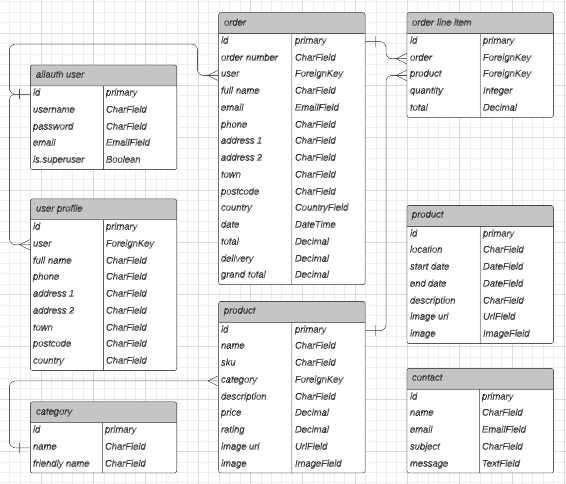
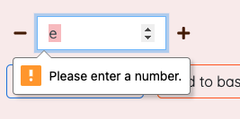
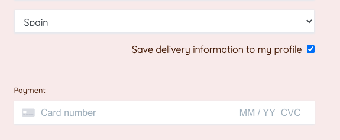
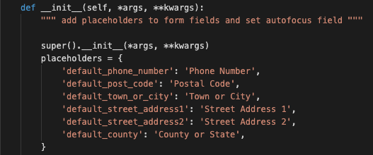

<h1 align="center">CoffeeShop</h1>

CoffeeShop is an online retailer selling coffee, coffee subscriptions, and related equipment. It specialises in high  quality specialty coffees, offering customs a wide range of flavour profiles to suit every coffee lover. 

Users can create an account and save their information to speed up the buying process for future transactions. The admin has write, edit and delete capabilities via admin controls as well as the Django admin panel.

Test payments can be carried out using card number: 
4242 4242 4242 4242 with CVC and ZIP any combination of numbers.

<a href="https://coffeeshop-pp5.herokuapp.com/" target="_blank">View the live project here.</a>

CoffeeShop is a B2C (business to customer) business, providing a service to a specific customer base. The products, language, and design are all adapted to suit the target audience with the aim of increasing user interaction and purchases.

 

## User Experience (UX)

-   ### User stories

An Agile approach was taken to the planning and execution of this project, which included user stories in a kanban board being moved to the relevant column during development. 
You can find the project board <a href="https://github.com/EllieThurlwell/project-five/projects/1" target="_blank">here.</a>

1. As a site user I want to be able to register an account so that I can view my profile and save my information.

2. As a site user I want to be able to log in and log out so that I can access my profile and keep it safe.

3. As a site user I want to be able to reset my password so that I can still access my account if I have forgotten my log in.

4. As a site owner I want to be able to add products so that I can keep the product catalogue up to date.

5. As a site owner I want to be able to edit and update products so that I can change the price/description/image etc for a product.

6. As a site owner I want to be able to delete products so that I can remove items no longer in the catalogue.

7. As a customer I want to be able to view all the products so that I can decide whether I want to purchase anything.

8. As a customer I want to be able to view a product's details so that I can know the price, description, rating etc before buying.

9. As a customer I want to be able to see the current total of my shopping basket so that I can avoid overspending.

10. As a customer I want to be able to search for a product by name so that I can quickly find what I am looking for.

11. As a customer I want to be able to filter products by category so that I can easily view related products and sort by certain criteria.

12. As a customer I want to be able to easily select the size or quantity so that I can purchase the product exactly how I wish.

13. As a customer I want to be able to view my basket so that I can see the total cost of the order and make changes before checkout.

14. As a customer I want to be able to input my payment details so that I can easily checkout and complete my purchase.

15. As a customer I want to be able to know my information is secure so that I can confidently and happily provide sensitive data.

16. As a customer I want to be able to receive email confirmation of purchases so that I can review and archive my transactions.

-   ### Design
-   #### Bootstrap
    The site uses Bootstrap as the basis for its layout design. This was chosen based on cleanliness of design, responsiveness, and ease of use. The built in classes make it straight forward to consistently style elements for a harmonious site-wide style.
-   #### Colours
    The colour scheme of the site is quite simple and clean. The main text colour is a deep brown reminiscent of coffee beans, with a bright orange and blue used to catch the users attention to important elements. This remains consistent in the images used. The background is a warm off white throughout, making the site more welcoming and comfortable to spend time on.
    

-   #### Imagery
    Imagery used on the site fits a specific purpose. The homepage banner image immediately lets the user know what the site is about, while the product images are necessary and expected of an e-commerce application. The images on the locations page show the appearance of each location, making it easier for the user to recognise should they wish to visit. The error pages banner image is reminiscent of the homepage, with a slight humourous alteration.
-   #### Typography
    The two fonts used throughout the site are Varela Round and Quicksand. Using two fonts allows for differentiation between elements of different importance. They are both clean, modern and easy to read fonts.
       

*   ### Wireframes

    Wireframes for the planning of the homepage and other intended pages of the site, with consistent elements such as header and footer featured on all.
    

    Lucidchart was used to create the diagram of the databases, their fields, and their interactions with each other.
    

 

## Features

-   ### Responsive across a variety of screen sizes

-   ### Registration, login and logout capabilities

-   ### Feedback for user actions throughout

-   ### Database models to store user and site data

-   ### Product search and filtering options

-   ### Straightforward and secure payments

 

- Main header and navbar with logo link to home, a search box, links to the user account pages, and to the basket, and a free delivery information banner. The basket link displays the current total.

- Footer featuring social media links, a Mailchimp subscription form, and link to the contact form page. Secondary footer section contains the privacy policy.

- Home page with bold title and subtitle. The large banner image immediately informs the user as to the nature of the site.

- Products page shows a list of all products available. It is filtered via categories in the dropdown menu, or alternatively via current category buttons. Each item has an image, the name, price and rating(if it exists).

- Product detail page opens when an item is clicked on. It features a larger image of the product along with all the information previously seen on the products page. Additionally there is a short description of each product. The user can select the quantity of the item they want and add it to their basket.

- Subscription page gives the user more information about the coffee subscription options available. It features an image of one of the bags of coffee alongside an orange cup of coffee, in keeping with the colour scheme of the site.

- Locations page shows the user a range of cafes that current brew CoffeeShop coffee, so they can decide whether to visit. There is an image of each cafe, the name and short description, and the dates during which coffee will be available there.

- The basket contains all the items a user has added. It shows them an image of each product, the quantity of that product they have added and the total for that product. Below it displays the subtotal, delivery charge and order total, as well as informing the user how much more they must spend to get free delivery. The user can decide whether to continue shopping or go to the checkout.

- Checkout page contains a form for the user to input their delivery details and finally payment information. If they are logged in they are asked if they would like to save this information (minus card info), and if not they are informed that by logging in or signing up they can save this information. There is also a summary of the basket. The user can return to the basket or go ahead with placing the order.

- Checkout success page lets the user know that their order has been placed successfully. It shows details of the order and delivery address and lets them know that a confirmation email has been sent to them.

- Sign up, log in and log out pages allow the user to create an account and access certain features of the store, for example saving their information.

- Profile page is accessible to logged in users. It displays the information currently saved and allows them to edit it. There is also a list of past orders the user has made, which they can examine at will.

- Contact page features a form through which a user can send a message to CoffeeShop. It requires a name, email and message, with optional subject.

- Admin controls page allows the logged in admin user to access forms to add a product or location to the database. Edit buttons on all products and locations directs the admin to a form prepopulated with that item's information, which they can edit and then save. A delete button allows the admin to delete a product or location from the database. Therefore they have full CRUD capabilities - they can Create new objects, Read existing objects, Update objects and also Delete them.

- Django admin panel allows the site owner to access the products, categories and locations databases, as well as view all accounts. They have full CRUD capabilities here too.

 

## Features to implement in the future

- When an admin user deletes a product or location, they would be asked to confirm they want to carry out that action before it is implemented.
- A 'save to favourites' feature would be available for users with a registered account, allowing them to save their favourite coffees or products so they can find them faster in the future.
- Registered users would be able to review products they have previously purchased so all visitors to the site can see feedback from actual customers.
- The site would also sell a range of gift cards of different amounts. Customers would be able to purchase these to give as gifts, potentially expanding the customer base and increasing sales.

 

### Django features to improve in the future

- The subscription options available to customers would be created in their own Djando app rather than being product objects in the Products app. This would allow them to be fully separate entities that can be filtered and looped through, similar to the products in the Coffee menu.
    -   This would also allow the subscriptions template to be more easily styled in a user friendly way - there could be dropdown menus for each type of subscription or sections for coffee bean or ground coffee options.

 

## Facebook business page

- This mock up Facebook business page shows how the CoffeeShop business would interact with its audience, to keep them engaged and interested in the products. Regular updates would include new coffees and equipment available at the store, behind the scenes photos from any shoots or events, and general news about the business. The tone is casual and friendly to make the business seem approachable and desirable.
<h2 align="center"></h2>

 

## Languages Used

-   [HTML5](https://en.wikipedia.org/wiki/HTML5)
-   [CSS3](https://en.wikipedia.org/wiki/Cascading_Style_Sheets)
-   [JavaScript](https://en.wikipedia.org/wiki/JavaScript)
-   [Python 3.8](https://en.wikipedia.org/wiki/Python_(programming_language))

### Frameworks, Libraries & Programs Used

- [Django:](https://docs.djangoproject.com/en/4.0/)
    - Fullstack Django framework was used to build the application.
- [Bootstrap:](https://getbootstrap.com/)
    - Bootstrap was used for the design layout.
- [Font Awesome:](https://fontawesome.com/)
    - Font Awesome was used for all icons.
- [Google Fonts:](https://fonts.google.com/)
    - Google Fonts was used for all fonts.
- [Mailchimp:](https://mailchimp.com/)
    - Mailchimp was used to add the email sign up form.
- [Stripe:](https://stripe.com/es)
    - Stripe was used to process the payments and handle webhooks.
- [Git:](https://git-scm.com/)
    - Git was used for version control by utilizing the Gitpod terminal to commit to Git and push to GitHub.
- [GitHub:](https://github.com/)
    - GitHub is used to store the project's code after being pushed from Git.
- [Heroku:](https://www.heroku.com/)
    - Heroku was used for the deployment of the project.
- [AWS S3:](https://aws.amazon.com/)
    - AWS was used to store static and media files.
- [Balsamiq:](https://balsamiq.com/)
    - Balsamiq was used to create the wireframes during the design process.
- [Lucidchart:](https://www.lucidchart.com/pages/)
    - Lucidchart was used to mock up the databases during the project design process.

 

## Testing

### Testing User Stories

1. As a site user I want to be able to register an account so that I can view my profile and save my information.
    - The homepage features a link to register, with an account icon to make it visible to first time users. All test user accounts worked as expected - user was able to sign up, received email to confirm account, and successfully complete the process.

2. As a site user I want to be able to log in and log out so that I can access my profile and keep it safe.
    - The account link also has log in, log out and profile options depending on whether the user is currently logged in. The links all function as they should, and the profile link correctly navigates to any saved user information.

3. As a site user I want to be able to reset my password so that I can still access my account if I have forgotten my log in.
    - The log in page has a 'forgot password' link to allow the user to recover their account and set a new password should they need to. This has been tested and works correctly, and is also a straight forward process for the user. An email is sent to their address with a link to reset the password. They must enter a new password and confirm it, which is then changed and they are able to log in using it.

4. As a site owner I want to be able to add products so that I can keep the product catalogue up to date.
    - The site owner has sole access to the Django admin panel. A logged in admin user has access to admin controls to add products to the database. No other user can access this page. If attempted they are redirected and shown an error message.

5. As a site owner I want to be able to edit and update products so that I can change the price/description/image etc for a product.
    - Within the Django admin the site owner can also view and edit existing product objects. From the products page and details pages an admin user can edit the specific product via a form. All test products that were added and edited acted as expected.

6. As a site owner I want to be able to delete products so that I can remove items no longer in the catalogue.
    - In the Django admin panel each product object has a delete button available to the site owner. They can also select multiple objects and perform the same delete action on them all. Logged in admin users have access to a delete button on all products if they are logged in. Test products were successfully deleted when testing this function.

7. As a customer I want to be able to view all the products so that I can decide whether I want to purchase anything.
    - The products page shows a list of available products and provides an image, name and price to inform the user. This is available to all site visitors. When the catalogue is updated any new products successfully display here.

8. As a customer I want to be able to view a product's details so that I can know the price, description, rating etc before buying.
    - Clicking on any product takes the user to the product details page which contains more information to help in their shopping experience. All products display this information as expected, in all categories and from all menus.

9. As a customer I want to be able to see the current total of my shopping basket so that I can avoid overspending.
    - The current total of the basket is displayed in the header of the site and is visible on all pages. If delivery charges apply the total displayed includes this amount. The current amount correctly updates whenever a product is added or removed from the basket, behaving as expected. When an item is added a message is also displayed showing the user the current contents of their basket.

10. As a customer I want to be able to search for a product by name so that I can quickly find what I am looking for.
    - The header also contains a search icon which opens into a searchbar. The user can search a certain term, and if it is found in any product name or product description those products will be shown. The search term used and amount of results is also shown. Through all test searches this function worked as expected.

11. As a customer I want to be able to filter products by category so that I can easily view related products and sort by certain criteria.
    - The main navbar features dropdown menus that the user can use to view only products of a certain category. The product categories are also shown at the top of the products page when accessed from any menu. The correct set of products are shown as expected when category links are clicked.

12. As a customer I want to be able to easily select the size or quantity so that I can purchase the product exactly how I wish.
    - The quantity selector box on the product details page is clear and easy to use. It can be used in several ways including the + and - buttons, up and down arrows, and by typing an input in the box. Inputs outside of the valid range are caught and show an error to the user. This has worked well durind testing, however an issue is present on first loading a product page which allows the user to click the - button and change the quantity to 0. They cannot however add a quantity of 0 to the basket. Non numerical inputs are also successfully flagged.

13. As a customer I want to be able to view my basket so that I can see the total cost of the order and make changes before checkout.
    - The basket page provides an overview of all products added and has controls for adding more of that item and deleting it from the basket entirely. When testing the possible changes to the basket all details update as expected and the order total is shown correctly.

14. As a customer I want to be able to input my payment details so that I can easily checkout and complete my purchase.
    - The checkout page uses Stripe to handle the payments. This is straight forward and intuitive, easy for a first time user to handle. When testing purchases using the test card number, all transactions were successful and easy.

15. As a customer I want to be able to know my information is secure so that I can confidently and happily provide sensitive data.
    - Stripe being used to handle the payments gives the user peace of mind that their information is safe. To remain visibly secure there is no option to save card or payment information to a user's account, only their delivery details.

16. As a customer I want to be able to receive email confirmation of purchases so that I can review and archive my transactions.
    - Confirmation emails are sent after every successful transaction. On screen messages also inform the user as to the success of their actions. For test transactions carried out this email was always sent successfully.

### Further Testing

-   The website was tested on Google Chrome, Safari and Brave browsers on both desktop and mobile, and Firefox on desktop.
-   The website was viewed on a variety of devices including MacBook, Windows laptop, iPad Air, iPhone 7 plus, iPhone 12 mini, Samsung Galaxy Note8 and Samsung Galaxy Note20 Ultra.
-   Friends and family members were asked to review the site and all functionality to point out any issues. The back to top button on the products page worked intermittently on an iPad, but after investigating it no errors were found.
-   Family memebers were asked to test all user input functionality including creating and verifying an account, adding products to the basket and modifying them, checking out using the test card number, and confirming receipt of confirmation emails. No issues or unusual behaviour was reported.

 

The code passes through the HTML validator with one error:

Upon inspection of the relevant section, this is due to code in a view to display the add product or location forms:

This has been intentionally left in the project as it would take away an important aspect of these forms.
There were warnings relating to type attributes on Javascript resources; I have chosen to leave these as they are.

 

CSS code passes through the validator with no errors

 

Python code passes validation except for several instances of the same error, when a model or class is said to not have any member by a certain term, eg:

As the code and intended function associated with all of these instances works correctly and as expected, no fix has been attempted.

 

## Deployment

### Heroku

The site was deployed to Heroku early on in development to check everything was working and allow for continual comparison of development and deployed sites.

- Install Django and supporting libraries
- Django, gunicorn, dj_database_url, psycopg2 installed and added to requirements.txt
- Start Django project and any apps eg. home
- Ensure all changes to the database are migrated
- Create Heroku app with project name and location
- Navigate to resourses-addons and add 'heroku postgres'
- Navigate to settings-reveal config vars and copy database url to env.py file in gitpod and ensure the file is in gitignore
- Set database url and secret keys in gitpod and Heroku
- Create a Procfile in gitpod and in it tell Heroku to treat this as a web application
- In Heroku deploy-deployment method connect GitHub repository and enable automatic deployment if desired
- Click deploy branch to begin Heroku deploy
- Once complete the Heroku app will be available

 

- When any changes are made to the project during development, the following steps will allow changes to be pushed to Heroku and the updated site to be deployed:
    - in the gitpod terminal run the command `heroku login -i` and log in with Heroku credentials
    - run `heroku git:remote -a your-app-name` and replace `your-app-name` with the name of the Heroku app. This will link the app to the gitpod terminal
    - once linked run `git push heroku main`. The project will be deployed once this is complete
- For this project to run the following must also be present in the Heroku config vars:
    - USE_AWS
    - AWS_ACCESS_KEY_ID
    - AWS_SECRET_ACCESS_KEY
    - EMAIL_HOST_USER
    - EMAIL_HOST_PASS
    - STRIPE_PUBLIC_KEY
    - STRIPE_SECRET_KEY
    - STRIPE_WH_SECRET
- Debug should be set to False in gitpod

 

## Credits

### Code

-   Gitpod workspace came from this Code Institute [template](https://github.com/Code-Institute-Org/gitpod-full-template).
-   Layout of README file came from this Code Institute [sample](https://github.com/Code-Institute-Solutions/SampleREADME).
-   Django app setup was informed by the Code Institute 'I Think Therefore I Blog' walkthrough.
-   Main e-commerce functionality was informed by the Code Institute 'Boutique Ado' walkthrough. Much credit is owed to this module.

### Content

All content was created by the developer.

### Media

The main images for the site and for all products were taken and edited by the developer.

All equipment and location images are used under the Unsplash or Shutterstock license of free use.

### Other

Many thanks to Code Institute tutor support and mentor [Akshat Garg](https://github.com/akshatnitd), for their help during this project.