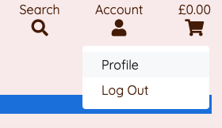
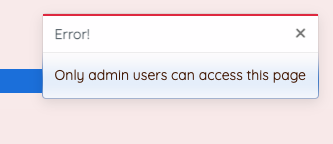

<h1 align="center">CoffeeShop</h1>

CoffeeShop is an online retailer selling coffee, coffee subscriptions, and related equipment. It specialises in high  quality specialty coffees, offering customs a wide range of flavour profiles to suit every coffee lover. 

Users can create an account and save their information to speed up the buying process for future transactions. The admin has write, edit and delete capabilities via the admin panel.

Test payments can be carried out using card number: 
4242 4242 4242 4242 with CVC and ZIP any combination of numbers.

<a href="https://coffeeshop-pp5.herokuapp.com/" target="_blank">View the live project here.</a>

<h2 align="center"></h2>

## User Experience (UX)

-   ### User stories

An Agile approach was taken to the planning and execution of this project, which included user stories in a kanban board being moved to the relevant column during development. 
You can find the project board <a href="https://github.com/EllieThurlwell/project-five/projects/1" target="_blank">here.</a>

1. As a site user I want to be able to register an account so that I can view my profile and save my information.
2. As a site user I want to be able to log in and log out so that I can access my profile and keep it safe.
3. As a site user I want to be able to reset my password so that I can still access my account if I have forgotten my log in.
4. As a site owner I want to be able to add products so that I can keep the product catalogue up to date.
5. As a site owner I want to be able to edit and update products so that I can change the price/description/image etc for a product.
6. As a site owner I want to be able to delete products so that I can remove items no longer in the catalogue.
7. As a customer I want to be able to view all the products so that I can decide whether I want to purchase anything.
8. As a customer I want to be able to view a product's details so that I can know the price, description, rating etc before buying.
9. As a customer I want to be able to see the current total of my shopping basket so that I can avoid overspending.
10. As a customer I want to be able to search for a product by name so that I can quickly find what I am looking for.
11. As a customer I want to be able to filter products by category so that I can easily view related products and sort by certain criteria.
12. As a customer I want to be able to easily select the size or quantity so that I can purchase the product exactly how I wish.
13. As a customer I want to be able to view my basket so that I can see the total cost of the order and make changes before checkout.
14. As a customer I want to be able to input my payment details so that I can easily checkout and complete my purchase.
15. As a customer I want to be able to know my information is secure so that I can confidently and happily provide sensitive data.
16. As a customer I want to be able to receive email confirmation of purchases so that I can review and archive my transactions.

-   ### Design
    -   #### Bootstrap
        -   The site uses Bootstrap as the basis for its layout design. This was chosen based on cleanliness of design, responsiveness, and ease of use. The built in classes make it straight forward to consistently style elements for a harmonious site-wide style.
    -   #### Colours
        - The colour scheme of the site is quite simple and clean. The main text colour is a deep brown reminiscent of coffee beans, with a bright ornage and blue used to catch the users attention to important elements. This remains consistent in the images used.
    -   #### Imagery
        -   Imagery used on the site fits a specific purpose. The homepage banner image immediately lets the user know what the site is about, while the product images are necessary and expexted of an e-commerce application. The images on the locations page show the appearance of each location, making it easier for the user to recpgnise should they wish to visit.
    -   #### Typography
        -   The two fonts used throughout the site are Varela Round and Quicksand. Using two fonts allows for differentiation between elements of different importance. They are both clean, modern and easy to read fonts.
       

*   ### Wireframes

    -   Wireframes for the homepage and other planned pages of the site, with consistent elements such as header and footer featured on all.
    <h2 align="center"></h2>
    -   Lucidchart was used to create the initial idea of the databases and their interactions with eachother.
    <h2 align="center"></h2>

## Features

-   ###### Responsive across a variety of screen sizes

-   ###### Registration, login and logout capabilities

-   ###### Feedback for user actions throughout

-   ###### Database models to store user and site data

-   ###### Product search and filtering options

-   ###### Straightforward and secure payments

- main header and navbar with logo link to home, a search box, links to the user account pages, and to the basket. The basket link displays the current total
- footer featuring social media links, a mailchimp subscription form, and link to the contact form page. Secondary footer section contains the privacy policy.
- home page with bold titles and subtitles. The large banner image immediately imforms the user as to the nature of the site.
- products page shows a list of all products available. It is filtered via categories in the dropdown menu, or alternatively via current category buttons. Each item has an image, the name, price and rating(if it exists).
- product detail page opens when an item is clicked on. It features a larger image of the product along with all the information previously seen on the products page. Additionally there is a short description of each product. The user can select the quantity of the item they want and add it to their basket.
- subscription page gives the user more information about the coffee subscription options available. It features an image of one of the bags of coffee alongside an orange cup of coffee, inkeeping with the colour scheme of the site.
- locations page shows the user a group of cafes that current brew CoffeeShop coffee, so they can decide whether to visit. There is an image of each cafe, the name and short description, and the dates during which coffee will be avaolable there.
- basket contains all the items a user has added. It shows them an image of each product, the quantity of that product they have added and the total for that product. Below it displays the subtotal, delivery charge and order total, as well as informing the user how much more they muct spend to get free delivery. The user can decide whether to continue shopping or go to the checkout.
- checkout page contains a form for the user to input their delivery details and finally payment information. If they are logged in they are asked if they would like to save this information (minus card info). There is also a summary of the basket. The user can return to the basket or go ahead with placing the order.
- checkout success page lets the user know that their order has been placed successfully. It shows details of the order and delivery address and lets them know that a confirmation email has been sent to them.
- register, log in and log out pages allow the user to create an account and access certain features of the store, for example saving their information.
- profile page is accessible to logged in users. It displays the information currently saved and allows them to edit it. There is also a list of past orders the user has made, which they can examine.
- contact page features a form through which a user can send a message to CoffeeShop. It requires a name, email and message, with optional subject.
- admin panel allows the site owner to access the products, categories and locations databases. They can Create new objects, Read existing objects, Update objects and also Delete them.

## Features to implement in the future

- the site owner would be able to create, read, update and delete products etc from within the main site navigation rather than relying on the django admin panel.

## Facebook business page

- This mock up Facebook business page shows hwo the CoffeeShop business would interact with its audience, to keep them engaged and interested in the products
<h2 align="center"></h2>

### Languages Used

-   [HTML5](https://en.wikipedia.org/wiki/HTML5)
-   [CSS3](https://en.wikipedia.org/wiki/Cascading_Style_Sheets)
-   [JavaScript](https://en.wikipedia.org/wiki/JavaScript)
-   [Python 3.8](https://en.wikipedia.org/wiki/Python_(programming_language))

### Frameworks, Libraries & Programs Used

- [Django:](https://docs.djangoproject.com/en/4.0/)
    - Fullstack Django framework was used to build the application.
- [Bootstrap:](https://getbootstrap.com/)
    - Bootstrap was used for the design layout.
- [Font Awesome:](https://fontawesome.com/)
    - Font Awesome was used for all icons.
- [Google Fonts:](https://fonts.google.com/)
    - Google Fonts was used for all fonts.
- [Mailchimp:](https://mailchimp.com/)
    - Mailchimp was used to add the email sign up form.
- [Stripe:](https://stripe.com/es)
    - Stripe was used to process the payments and handle webhooks.
- [Git:](https://git-scm.com/)
    - Git was used for version control by utilizing the Gitpod terminal to commit to Git and push to GitHub.
- [GitHub:](https://github.com/)
    - GitHub is used to store the project's code after being pushed from Git.
- [Heroku:](https://www.heroku.com/)
    - Heroku was used for the deployment of the project.
- [AWS S3:](https://aws.amazon.com/)
    - AWS was used to store static and media files.
- [Balsamiq:](https://balsamiq.com/)
    - Balsamiq was used to create the wireframes during the design process.
- [Lucidchart:](https://www.lucidchart.com/pages/)
    - Lucidchart was used to mock up the databases during the project design process.

## Testing

### Testing User Stories

1. As a site user I want to be able to register an account so that I can view my profile and save my information.
    - The homepage features a link to register, with an account icon to make it visible to first time users.
<h2 align="center"></h2>

2. As a site user I want to be able to log in and log out so that I can access my profile and keep it safe.
    - The account link also has log in, log out and profile options depending on whether the user is currently logged in.
3. As a site user I want to be able to reset my password so that I can still access my account if I have forgotten my log in.
    - The sign in page has a 'forgot password' link to allow the user to recover their account and set a new password should they need to.
<h2 align="center"></h2>

4. As a site owner I want to be able to add products so that I can keep the product catalogue up to date.
    - The site owner has sole access to the admin panel from which they can easily add new products.
5. As a site owner I want to be able to edit and update products so that I can change the price/description/image etc for a product.
    - Within the admin the site owner can also view and edit existing product objects.
<h2 align="center"></h2>

6. As a site owner I want to be able to delete products so that I can remove items no longer in the catalogue.
    - Each product object has a delete button available to the site owner. They can also select multiple objects and perform the same delete action on them all.
<h2 align="center"></h2>
7. As a customer I want to be able to view all the products so that I can decide whether I want to purchase anything.
    - The products page shows a list of available products and provides an image, name and price to inform the user.
<h2 align="center"></h2>
8. As a customer I want to be able to view a product's details so that I can know the price, description, rating etc before buying.
    - Clicking on any product takes the user to the product details page which contains more information to help in their shopping experience.
<h2 align="center"></h2>
9. As a customer I want to be able to see the current total of my shopping basket so that I can avoid overspending.
    - The current total of the basket is displayed in the header of the site and is visible on all pages.

10. As a customer I want to be able to search for a product by name so that I can quickly find what I am looking for.
    - The header also contains a search icon which opens into a searchbar. The user can search a certain term, and if it is found in any product name or description those products will be shown.
11. As a customer I want to be able to filter products by category so that I can easily view related products and sort by certain criteria.
    - The main navbar features dropdown menus that the user can use to view only products of a certain category. The product's category is also shown on the details page.

12. As a customer I want to be able to easily select the size or quantity so that I can purchase the product exactly how I wish.
    - The quantity selector box on the product details page is clear and easy to use.

13. As a customer I want to be able to view my basket so that I can see the total cost of the order and make changes before checkout.
    - The basket page provides an overview of all products added and has controls for adding more of that item and deleting it from the basket entirely.

14. As a customer I want to be able to input my payment details so that I can easily checkout and complete my purchase.
    - The checkout page uses Stripe to handle the payments. This is straight forward and intuitive, easy for a first time user to use.
15. As a customer I want to be able to know my information is secure so that I can confidently and happily provide sensitive data.
    - Stripe being used to handle the payments gives the user peace of mind that their information is safe.
16. As a customer I want to be able to receive email confirmation of purchases so that I can review and archive my transactions.
    - Confirmation emails are sent after every successful transaction. On screen messages also inform the user as to the success of their actions.

### Further Testing

-   The website was tested on Google Chrome, Safari and Brave browsers on both desktop and mobile, and Firefox on desktop.
-   The website was viewed on a variety of devices including MacBook, laptop, iPad Air, iPhone 7 plus, iPhone 12 mini, Samsung Galaxy Note8 and Samsung Galaxy Note20 Ultra.
-   Friends and family members were asked to review the site and all functionality to point out any issues. The back to top button on the products page worked intermittently on an iPad, but after investigating it no errors were found.
-   Family memebers were asked to test all user input functionality including creating and verifying an account, adding products to the basket and modifying them, checking out using the test card number, and confirming receipt of confirmation emails. No issues or unusual behaviour was reported.

## Deployment

### Heroku

The sie was deployed to Heroku early on in development to check everything was working and allow for continual comparison of development and deployed sites.

- Install Django and supporting libraries
- Django, gunicorn, dj_database_url, psycopg2 installed and added to requirements.txt
- Start Django project and apps
- Ensure changes to the database are migrated
- Create Heroku app with name and location
- navigate to resourses-addons and add heroku postgres
- reveal config vars and copy database url to env.py file and ensure it is in gitignore
- set database and secret keys in gitpod and Heroku
- create a procfile and in it tell Heroku to treat this as a web application
- in Heroku deploy settings link GitHub repository and enable automatic deployment if desired
- click deploy branch to begin Heroku deploy
- once complete the Heroku app will be available

## Credits

### Code

-   Gitpod workspace came from this Code Institute [template](https://github.com/Code-Institute-Org/gitpod-full-template).
-   Layout of README file came from this Code Institute [sample](https://github.com/Code-Institute-Solutions/SampleREADME).
-   Django app setup was informed by the Code Institute 'I Think Therefore I Blog' walkthrough.
-   Main e-commerce functionality was informed by the Code Institute 'Boutique Ado' walkthrough. Much credit is owed to this module.

### Content

-   All content was created by the developer.

### Media

The main images for the site and for all products were taken and edited by the developer.

All equipment and location images are used under the Unsplash or Shutterstock license of free use.

### Other

-   Many thanks to Code Institute tutor support and mentor [Akshat Garg](https://github.com/akshatnitd) for their help during this project.

Photo by <a href="https://unsplash.com/@picoftasty?utm_source=unsplash&utm_medium=referral&utm_content=creditCopyText">Mae Mu</a> on <a href="https://unsplash.com/?utm_source=unsplash&utm_medium=referral&utm_content=creditCopyText">Unsplash</a>

Photo by <a href="https://unsplash.com/@mistrjosh?utm_source=unsplash&utm_medium=referral&utm_content=creditCopyText">Joshua Michaels</a> on <a href="https://unsplash.com/?utm_source=unsplash&utm_medium=referral&utm_content=creditCopyText">Unsplash</a>
  

Photo by <a href="https://unsplash.com/@non_creation?utm_source=unsplash&utm_medium=referral&utm_content=creditCopyText">NON</a> on <a href="https://unsplash.com/s/photos/coffee?utm_source=unsplash&utm_medium=referral&utm_content=creditCopyText">Unsplash</a>

Photo by <a href="https://unsplash.com/@izgubljenausvemiru?utm_source=unsplash&utm_medium=referral&utm_content=creditCopyText">Tijana Drndarski</a> on <a href="https://unsplash.com/?utm_source=unsplash&utm_medium=referral&utm_content=creditCopyText">Unsplash</a>

Photo by <a href="https://unsplash.com/@mockupgraphics?utm_source=unsplash&utm_medium=referral&utm_content=creditCopyText">Mockup Graphics</a> on <a href="https://unsplash.com/s/photos/coffee-cup-takeaway?utm_source=unsplash&utm_medium=referral&utm_content=creditCopyText">Unsplash</a>
  

<a href="https://www.flaticon.com/free-icons/coffee-beans" title="coffee beans icons">Coffee beans icons created by Freepik - Flaticon</a>

coffee beans PNG Designed By Jason from <a href="https://pngtree.com"> Pngtree.com</a>

Photo by <a href="https://unsplash.com/@maltehelmhold?utm_source=unsplash&utm_medium=referral&utm_content=creditCopyText">Malte Helmhold</a> on <a href="https://unsplash.com/s/photos/coffee-foam?utm_source=unsplash&utm_medium=referral&utm_content=creditCopyText">Unsplash</a>
  

Photo by <a href="https://unsplash.com/@k8_iv?utm_source=unsplash&utm_medium=referral&utm_content=creditCopyText">K8</a> on <a href="https://unsplash.com/s/photos/coffee-foam?utm_source=unsplash&utm_medium=referral&utm_content=creditCopyText">Unsplash</a>

Photo by <a href="https://unsplash.com/@goran_ivos?utm_source=unsplash&utm_medium=referral&utm_content=creditCopyText">Goran Ivos</a> on <a href="https://unsplash.com/s/photos/coffee-foam?utm_source=unsplash&utm_medium=referral&utm_content=creditCopyText">Unsplash</a>

Photo by <a href="https://unsplash.com/@daanelise?utm_source=unsplash&utm_medium=referral&utm_content=creditCopyText">daan evers</a> on <a href="https://unsplash.com/?utm_source=unsplash&utm_medium=referral&utm_content=creditCopyText">Unsplash</a>
  
Photo by <a href="https://unsplash.com/@shawnanggg?utm_source=unsplash&utm_medium=referral&utm_content=creditCopyText">shawnanggg</a> on <a href="https://unsplash.com/?utm_source=unsplash&utm_medium=referral&utm_content=creditCopyText">Unsplash</a>
  
Photo by <a href="https://unsplash.com/@romanbozhko?utm_source=unsplash&utm_medium=referral&utm_content=creditCopyText">Roman Bozhko</a> on <a href="https://unsplash.com/?utm_source=unsplash&utm_medium=referral&utm_content=creditCopyText">Unsplash</a>
  
Photo by <a href="https://unsplash.com/@jazminantoinette?utm_source=unsplash&utm_medium=referral&utm_content=creditCopyText">Jazmin Quaynor</a> on <a href="https://unsplash.com/?utm_source=unsplash&utm_medium=referral&utm_content=creditCopyText">Unsplash</a>
  
Photo by <a href="https://unsplash.com/@rawkkim?utm_source=unsplash&utm_medium=referral&utm_content=creditCopyText">rawkkim</a> on <a href="https://unsplash.com/?utm_source=unsplash&utm_medium=referral&utm_content=creditCopyText">Unsplash</a>
  

https://hiddencoffeeroasters.com/en/

https://syra.coffee/

https://www.redemptionroasters.com/

https://lythamcoffee.com/